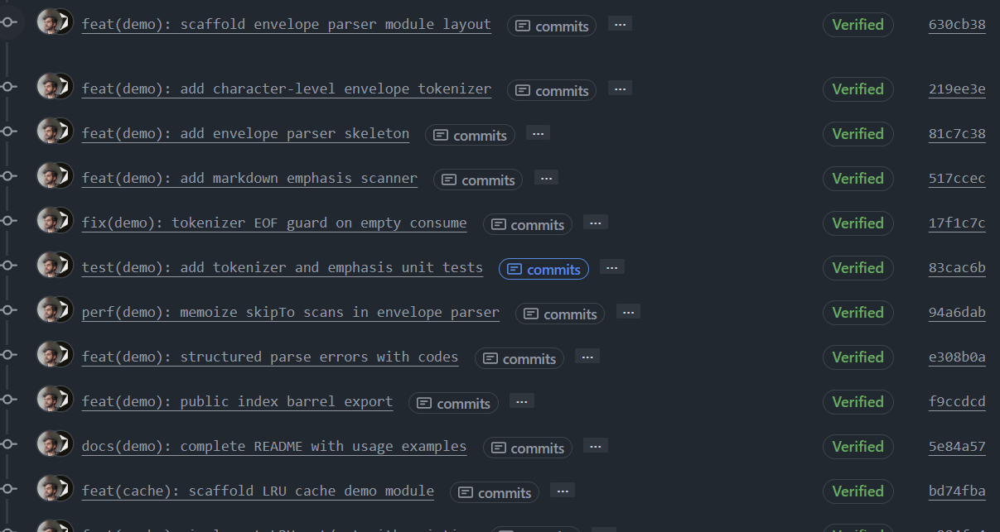
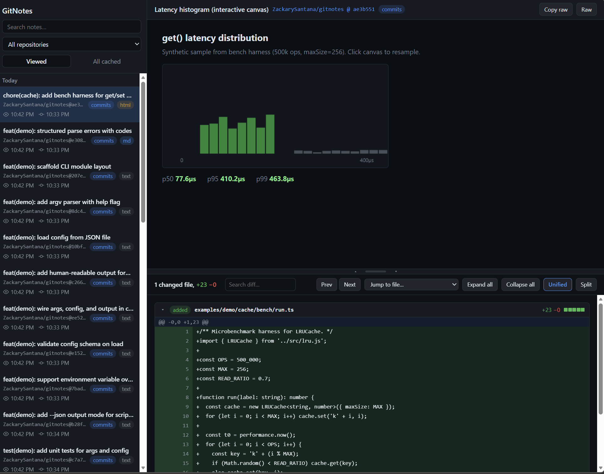
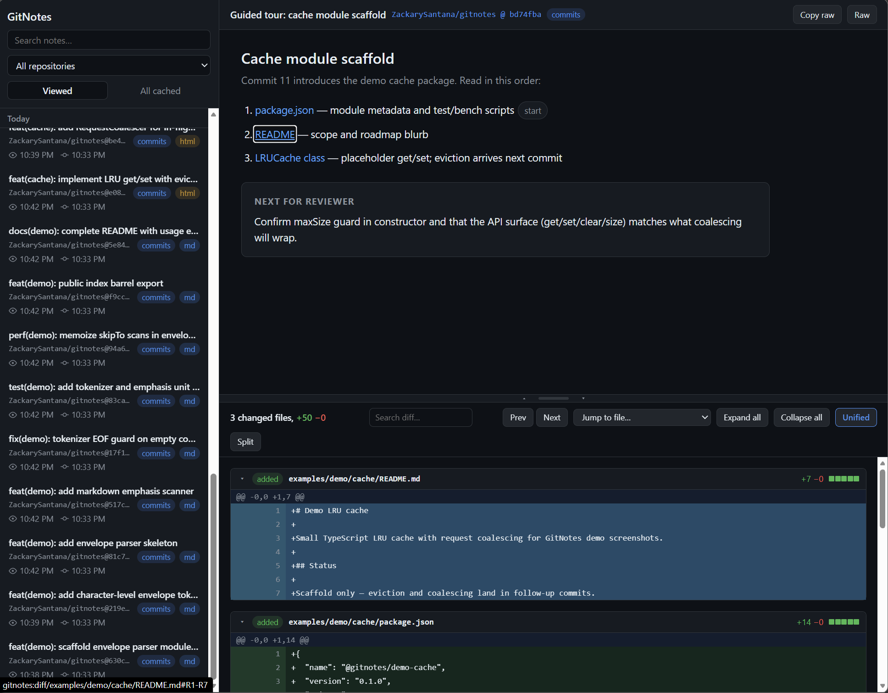

# GitNotes

A Chrome extension that shows `git notes` on GitHub.

Git has a built-in way to attach extra information to commits: [git notes](https://git-scm.com/docs/git-notes). GitHub stores them when you push them, but stopped displaying them years ago. So a useful place for review reports, benchmarks, and context ended up invisible. GitNotes brings them back: it fetches notes through the GitHub API and shows them right where you browse.

Notes can be plain text, markdown, or full interactive HTML pages that render safely in a sandboxed viewer, so a note can be anything from a one-line remark to a guided tour of a change with charts and links into the diff.

## Install

[Chrome Web Store](TBA) (link coming soon, pending review)

## What it looks like

Commits with notes get a badge on pull request and commit list pages:



Clicking a note opens the Hub, where the note renders above the commit's diff. Notes can be fully dynamic, like this interactive benchmark report:



Notes can also link directly into the diff, jumping to and highlighting specific files and lines:



## Writing notes

Notes are plain git. Attach one to a commit and push it:

```bash
git notes add -m "hello" <sha>
git push origin 'refs/notes/*'
```

## Privacy

GitNotes talks only to the GitHub API and stores everything locally in your browser. See [PRIVACY.md](PRIVACY.md).

## License

[MIT](LICENSE)
